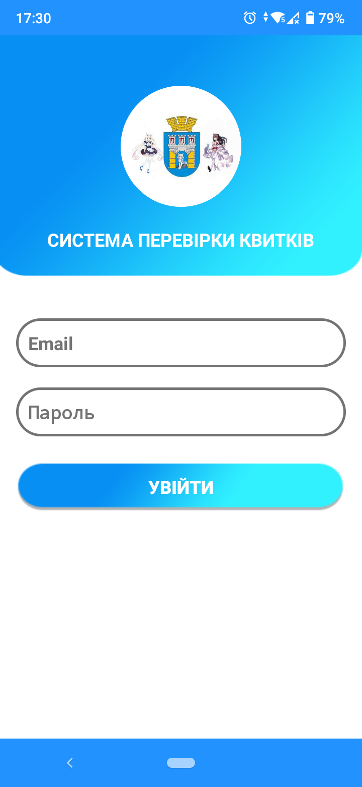
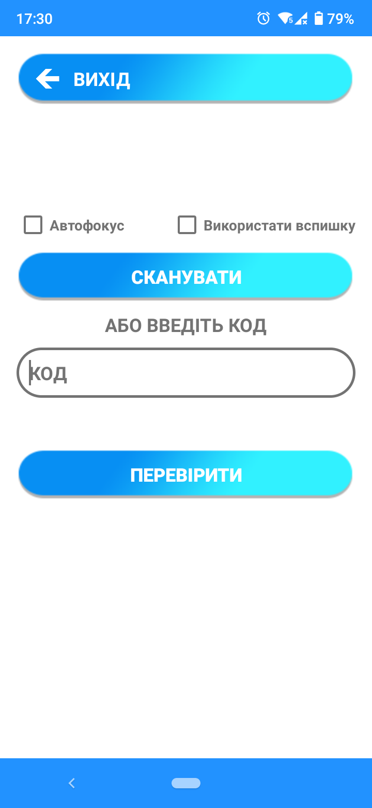
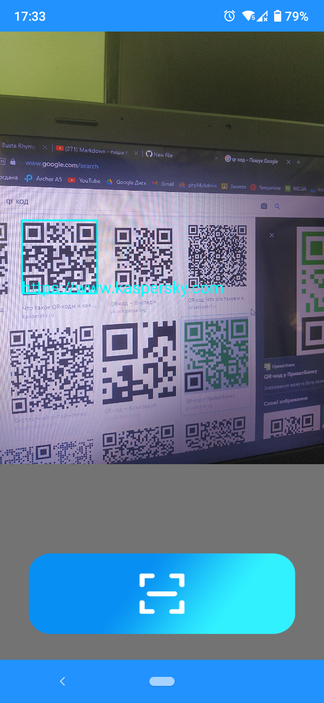
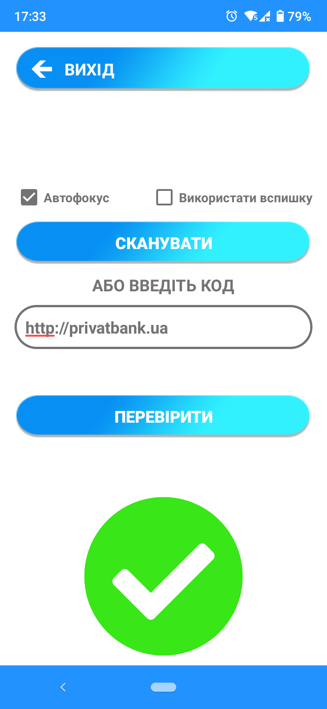

<p align="center"></p>
<h1 align="center">Animka-IF-Tickets</h1>

## Description
<b>EN:</b>

This is my project to scan QR codes from tickets for some event.

It was based on an application project from **GitHub**, using the ***Google Vision API*** library.

<b>UA:</b>

Це мій проект для сканування QR-кодів із квитків на деяку подію.

За основу було взято прикладний проект із **GitHub**, з використанням бібліотеки ***Google Vision API***.

#
## Screenshots
<p>
  
  
  
  
</p>

#
## Technologies used
<b>EN:</b>
- Internal authorization system
- Reading the image from the camera
- Reading QR codes from the image

<b>UA:</b>
- Внутрішня система авторизації
- Зчитування зображення з камери
- Зчитування QR-кодів із зображення

#
## License
```
© 2020, CoolOtaku (ericspz531@gmail.com)
```
